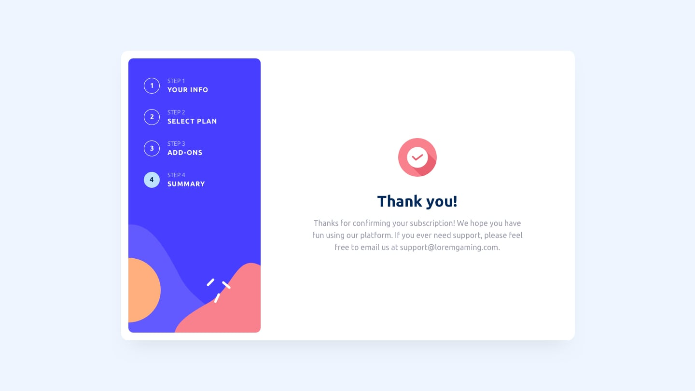
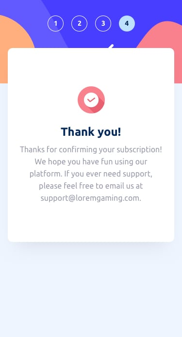

# Frontend Mentor - Multi-step form App


This is a solution to the [Multi-step form challenge on Frontend Mentor](https://www.frontendmentor.io/challenges/multistep-form-YVAnSdqQBJ). Frontend Mentor challenges help you improve your coding skills by building realistic projects.

<p align="center">
    
    
    
    
</p>
## 📖 Table of contents

- [Overview](#overview)
  - [The challenge](#the-challenge)
  - [Environment Configuration](#Environment-Configuration)
  - [Screenshot](#screenshot)
  - [Links](#links)
- [My process](#my-process)
  - [Built with](#built-with)
  - [What I learned](#what-i-learned)
- [Author](#author)
- [Acknowledgments](#acknowledgments)

## 🔭 Overview

### 📌 The challenge

Users should be able to:

Complete each step of the sequence

- Go back to a previous step to update their selections
- See a summary of their selections on the final step and confirm their order
- View the optimal layout for the interface depending on their device's screen size
- See hover and focus states for all interactive elements on the page
- Receive form validation messages if:

  - A field has been missed
  - The email address is not formatted correctly
  - A step is submitted, but no selection has been made

  ## ⚙️ Environment Configuration

### Recommended IDE Setup

[VSCode](https://code.visualstudio.com/) + [Volar](https://marketplace.visualstudio.com/items?itemName=Vue.volar) (and disable Vetur).

### Customize configuration

See [Vite Configuration Reference](https://vitejs.dev/config/).

## Project Setup

```sh
npm install
```

### Compile and Hot-Reload for Development

```sh
npm run dev
```

### Compile and Minify for Production

```sh
npm run build
```

### 📷 Screenshot

#### 🖥️ Desktop




#### 📱 Mobile




### 🔗 Links

Code:

[]([[https://your-solution-url.com](https://github.com/wan0805/mult-step-form)](https://github.com/wan0805/mult-step-form))

Live:

[]([[https://your-live-site-url.com](https://mult-step-form-eight.vercel.app/)](https://mult-step-form-eight.vercel.app/))

## ⚙️ My process

### 🛠️ Built with

- Semantic HTML5 markup
- CSS custom properties
- Flexbox
- CSS Grid
- Position
- Mobile-first workflow
- [Vue 3](https://vuejs.org/) - The Progressive framework
- [Pinia](https://pinia.vuejs.org/) - store library for Vue

### 🎓 What I learned

the use of the tag slot because with this tag I can reuse in several the styling and just change the information contained

To see how you can add code snippets, see below:

```html
<template>
  <header>
    <h1 class="form__title">
      <slot name="title"> </slot>
    </h1>

    <p class="form__description">
      <slot name="description"></slot>
    </p>
  </header>
</template>
```

```html
<template>
  <section class="form__wrapper">
    <TheHeader>
      <template v-slot:title>Personal info</template>
      <template v-slot:description
        >Please provide your name, email adress and phone number.</template
      >
    </TheHeader>
  </section>
</template>
```

## 🤵🏿Author

[](https://www.frontendmentor.io/profile/wan0805)

[](https://www.linkedin.com/in/wanderson-duarte-a9778711b/)

## 🙌 Acknowledgments

I want to thank God and my family for all the support
